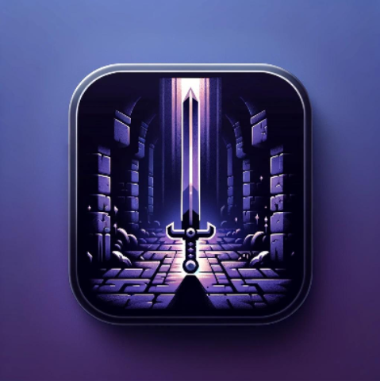

# **Endless Runner** (Temp Name?)

---
## Table of Contents
* [Description](#description)
* [General Info](#general-info)
* [Technologies Used](#technologies-used)
* [Features](#features)
* [Contacts](#contacts)
* [Acknowledgements](#acknowledgements)

---
## Description

Our project targets casual gamers, particularly those who enjoy quick, engaging gameplay experiences. The simplicity of controls and the excitement of endless running challenges make our game suitable for players of all ages and skill levels. Additionally, enthusiasts of the endless runner genre will find familiar mechanics intertwined with fresh elements in our game.
We aspire to provide an immersive and enjoyable gaming experience that captivates players' attention and offers them a delightful escape from the mundane. Through our project, we aim to ignite a sense of adventure and challenge while fostering moments of joy and achievement. By delivering a high-quality, dynamically generated gaming environment, we seek to redefine the boundaries of the endless runner genre and inspire creativity and innovation in game design.

---
## General Info

* ### Game Icon

---
## Technologies Used
* ### Unity
	1. The Unity game development engine provides a powerful and flexible environment for creating this 2D game. We will be incorporating graphics, animation, physics, collisions, audio, and other assets using this technology
	2. https://unity.com
* ### C\#
	1. The primary language that is going to be used in unision with Unity scripting to implement game logic, behaviors, and interactions
* ### Bitbucket 
	1. Used for version control, collaborative development and tracking progress throughout development
* ### Jira Integration
	1. Jira allows us to organize tasks, track progress. and manage project milestones

---
## First Sprint

	1. Creating a Play-Test Map 
		- For starters we will first add a grid style map that the player can traverse through. This will not be generated, it will be a play-test area to test new mechanics that we wish to implement. This corresponds to User Story 3 (green) and 1 (purple).
	2. Creating Default Sprites & Menus
		- We will then add temporary placement sprites so to not waste time just drawing/creating designs. We will then add a menu for people to change the settings of the game, such as volume and controls. The goal of the first sprint is to put in place core mechanics and features, not asthetics, so it will be basic. This corresponds to user story 2 (blue).
	3. Player Movement
		- We will add player movement to the game. This will consist of 4 directions, where the player will travel to the adjacent cell depending on the button pressed by the player. This corresponds to user story 1 (purple).
	4. Collision
		- We will implement collision handling for whenever the player runs into the wall, collides with enemies, and picks up powerups. This corresponds to user story 3 (green), 1 (purple), and 5 (red). 
	5. Obstacles & 
		- We will finally add simple obstacles that the player will have to maneuver around such as spikes. To assist the player, we will also add powerups. The first powerup we will add will be an item that negates all damage for a short period of time. This corresponds with user story 5 (red).
* ### Contributions
	1. Mateo:
		- Jira Task: Create a power up that negates all damage
			- [Scrum-00](),
    		[Bitbucket]()
		- Jira Task: Create a spike obstacle that deals damage to the player
			- [Scrum-00](),
    		[Bitbucket]()
		- Jira Task: Create/find backgroud art
			- [Scrum-81](https://cs3398s24betazoids.atlassian.net/browse/SCRUM-81),
    		[Bitbucket](https://bitbucket.org/cs3398s24betazoids/endlessrunner/src/1cce71da82aa0c250b219039961ad3f162889ca5/?at=feature%2FSCRUM-81-create-find-backgroud-art)
		- Jira Task: Create/Find basic charecter assets
			- [Scrum-80](https://cs3398s24betazoids.atlassian.net/browse/SCRUM-80),
    		[Bitbucket](https://bitbucket.org/cs3398s24betazoids/endlessrunner/src/1cce71da82aa0c250b219039961ad3f162889ca5/?at=feature%2FSCRUM-81-create-find-backgroud-art)
		- Jira Task: Create/find terrain art
			- [Scrum-85](https://cs3398s24betazoids.atlassian.net/browse/SCRUM-85),
    		[Bitbucket](https://bitbucket.org/cs3398s24betazoids/endlessrunner/src/SCRUM-85-create-find-terrain-art/)
		- Jira Task: Create a basic class structure for obstacles and power ups. this may
			- [Scrum-41](https://cs3398s24betazoids.atlassian.net/browse/SCRUM-41),
    		[Bitbucket](https://bitbucket.org/cs3398s24betazoids/endlessrunner/src/SCRUM-41-create-a-basic-class-structure-/)
	2. Daniel:
		- Jira Task: Research In Unity and C#
			- [Scrum-101](https://cs3398s24betazoids.atlassian.net/jira/software/projects/SCRUM/issues/SCRUM-101?jql=project%20%3D%20%22SCRUM%22%20and%20status%20%3D%20Done%20ORDER%20BY%20created%20DESC)
		- Jira Task: Created a Rewards System
			- [Scrum-57](https://cs3398s24betazoids.atlassian.net/jira/software/projects/SCRUM/issues/SCRUM-57?jql=project%20%3D%20%22SCRUM%22%20and%20status%20%3D%20Done%20ORDER%20BY%20created%20DESC)
		- Jira Task: Created a Leaderboard management
			- [Scrum-58](https://cs3398s24betazoids.atlassian.net/jira/software/projects/SCRUM/issues/SCRUM-58?jql=project%20%3D%20%22SCRUM%22%20and%20status%20%3D%20Done%20ORDER%20BY%20created%20DESC)
	3. Paloma:
		- Jira Task: Research how to start developing in Unity
		- Jira Task: Design player movement controls
		- Jira Tasl: Integreate collision mechanics with the movment script
		- Jira Task: Identify input devices and map control
			- [Scrum-10](https://cs3398s24betazoids.atlassian.net/browse/SCRUM-10),
    		[Bitbucket](https://bitbucket.org/cs3398s24betazoids/endlessrunner/src/b846000a7ae136e17e58f4981c2a3ab3081cc058/?at=feature%2FSCRUM-10-identify-input-devices-and-map-)
		- Jira Task: Write C# script to move the character
			- [Scrum-11](https://cs3398s24betazoids.atlassian.net/browse/SCRUM-11),
    		[Bitbucket](https://bitbucket.org/cs3398s24betazoids/endlessrunner/src/17f2029ca0b78bc82b2990db0ee087f22b5960fe/?at=feature%2FSCRUM-11-write-a-script-in-c-to-move-the)
		- Jira Task: Implement grid-like movement
			- [Scrum-12](https://cs3398s24betazoids.atlassian.net/browse/SCRUM-12),
    		[Bitbucket](https://bitbucket.org/cs3398s24betazoids/endlessrunner/src/be34ed4a4a5b2dfca0c522b773ce71fbcd3bddd8/?at=feature%2FSCRUM-12-implement-grid-like-movement)
		- Jira Task: Add a jump feature to the player movement
			- [Scrum-17](https://cs3398s24betazoids.atlassian.net/browse/SCRUM-17),
    		[Bitbucket](https://bitbucket.org/cs3398s24betazoids/endlessrunner/src/233c266b0a004e3fb5a4d766ac408cabfef3cd0c/?at=feature%2FSCRUM-17-add-a-jump)
	4. Javier:
		- Jira Task: Research how to development with Unity
		- Jira Task: Sketch the initial design of the main menu interface
			- [Scrum-15](https://bitbucket.org/cs3398s24betazoids/endlessrunner/commits/8dca0dcf25f27f0d88874cf98daf7cf370bf059b)
		- Jira Task: Create Menu Options
			- [Scrum-27](https://bitbucket.org/cs3398s24betazoids/%7B46ca96fa-e22e-49a3-aefa-c98a00f3dadc%7D/branch/SCRUM-27-create-menu-options-develop-int)
		- Jira Task: Construct a settings submenu
			- [Scrum-28](https://bitbucket.org/cs3398s24betazoids/endlessrunner/commits/7dcf41ca7bd0d9aa9c6b3eebaf37e0a308684cd4)
	5. Noe:
		- Jira Task: Create a grid that makes it to where only objects can move along the grid
			- [Scrum-37](https://cs3398s24betazoids.atlassian.net/browse/SCRUM-37)
		- Jira Task: Create a cell (tilemap) that keeps track of the locations of objects on screen to determine collision
			- [Scrum-39](https://cs3398s24betazoids.atlassian.net/browse/SCRUM-39)
		- Jira Task: Brainstorm Enemy types and attacks
			- [Scrum-69](https://cs3398s24betazoids.atlassian.net/browse/SCRUM-69)
		- Jira Task: Add collision of walls.
			- [Scrum-29](https://cs3398s24betazoids.atlassian.net/browse/SCRUM-29)			

* ### Next Steps:
	Add obstacles and enemies to the game to make it playable and interesting.
	
## Second Sprint
* ### Contributions 
	1. Mateo:
	2. Daniel:
	3. Paloma:
		- Jira Task: Add animations to coins
			- [Scrum-116](https://cs3398s24betazoids.atlassian.net/browse/SCRUM-116), 
			[Bitbucket](https://bitbucket.org/cs3398s24betazoids/endlessrunner/pull-requests/5)
		- Jira Task: Enable player to pick up coins 
			- [Scrum-114](https://cs3398s24betazoids.atlassian.net/browse/SCRUM-114), 
			[Bitbucket](https://bitbucket.org/cs3398s24betazoids/endlessrunner/pull-requests/7)
		- Jira Task; Implement point system for coins collected
			- [Scrum-115](https://cs3398s24betazoids.atlassian.net/browse/SCRUM-115), 
			[Bitbucket](https://bitbucket.org/cs3398s24betazoids/endlessrunner/pull-requests/21)
		- Jira Task: Enable a collision event with the player and obstacle
			- [Scrum-125](https://cs3398s24betazoids.atlassian.net/browse/SCRUM-125), 
			[Bitbucket](https://bitbucket.org/cs3398s24betazoids/endlessrunner/pull-requests/16)
		- Jira Task: Implement health system rules for the obstacle
			- [Scrum-126](https://cs3398s24betazoids.atlassian.net/browse/SCRUM-126), 
			[Bitbucket](https://bitbucket.org/cs3398s24betazoids/endlessrunner/pull-requests/23)
		- Jira Task: Generate coins throughout the accessible area
			- [Scrum-113](https://cs3398s24betazoids.atlassian.net/browse/SCRUM-113), 
			[Bitbucket](https://bitbucket.org/cs3398s24betazoids/endlessrunner/pull-requests/33)
		- Jira Task: Generate differrent obstacles throughout the accessible area
			- [Scrum-124](https://cs3398s24betazoids.atlassian.net/browse/SCRUM-124), 
			[Bitbucket](https://bitbucket.org/cs3398s24betazoids/endlessrunner/pull-requests/34)
	4. Javier:
	5. Noe: 
	
* ### Next Steps:
	Write next steps for Sprint 3 here
---
## Contacts
- [Mateo Cordeiro](www.linkedin.com/in/mateo-cordeiro-bb3a41b7) - mpc89@txstate.edu
- [Daniel Hamndan]() - orw17@txstate.edu
- [Paloma Resendiz]() - prr37@txstate.edu
- [Javier Rios]() - jer245@txstate.edu
- [Noe Soto]() - auy2@txstate.edu

---
## Acknowledgements
- [Dr. Ted Lehr]() - ted.lehr@txstate.edu